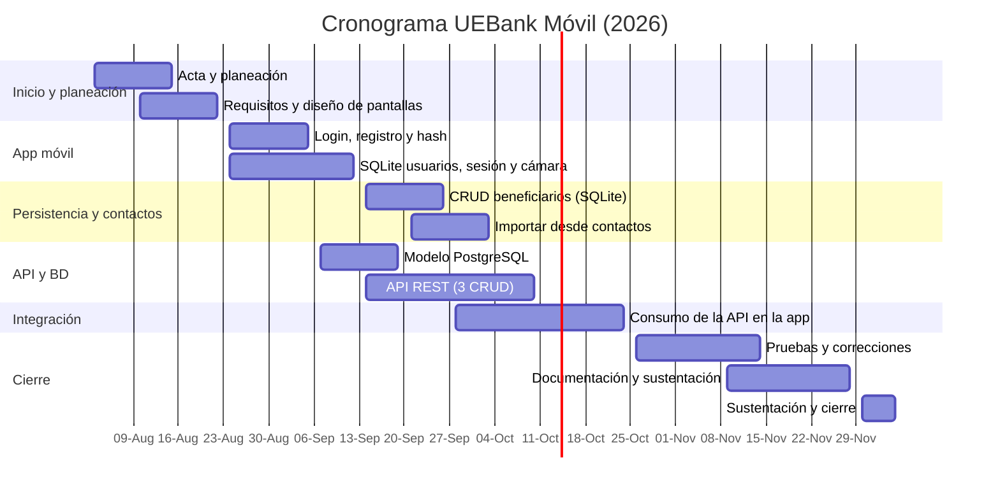

# Acta de Constitución del Proyecto — UEBank Móvil

> Artefacto PMBOK (Grupo de procesos de Inicio · "Desarrollar el acta de constitución del proyecto").
> Los campos marcados con **[COMPLETAR]** dependen de datos del grupo (nombres, fechas reales, docente). Fechas y costos son **estimaciones** ajustables.

---

## 1. Información del proyecto

| Campo | Detalle |
|---|---|
| Nombre del proyecto | UEBank Móvil — aplicación bancaria móvil para Android |
| Código | UEB-2026-01 |
| Institución / curso | Uniempresarial — Proyecto Uniempresarial **[COMPLETAR asignatura y docente]** |
| Patrocinador (sponsor) | Docente / Institución **[COMPLETAR]** |
| Director del proyecto | **[COMPLETAR integrante 1]** |
| Equipo de desarrollo (3 personas) | **[Integrante 1]** — App móvil y seguridad · **[Integrante 2]** — Base de datos local y recursos del dispositivo · **[Integrante 3]** — API REST y PostgreSQL |
| Fecha de inicio | 3 de agosto de 2026 |
| Fecha de finalización | 4 de diciembre de 2026 |
| Fecha del acta | 23 de septiembre de 2026 |

---

## 2. Propósito y justificación del proyecto

**Propósito.** Construir una aplicación móvil bancaria que permita a un cliente registrarse, autenticarse de forma segura, administrar sus cuentas, registrar movimientos, gestionar beneficiarios y fijar metas de ahorro desde su celular.

**Justificación.**

- **Necesidad:** los clientes esperan operar su dinero desde el teléfono, en cualquier momento y sin ir a una sucursal.
- **Seguridad:** las contraseñas nunca se guardan en texto plano (PBKDF2 con sal), y desde la incorporación de autenticación JWT la API también exige un token válido para leer o modificar cuentas, movimientos y metas — requisitos básicos en aplicaciones financieras.
- **Formación académica:** el proyecto integra las competencias exigidas por el curso: desarrollo Android con Java, persistencia local (SQLite, SharedPreferences, archivos), uso de recursos del dispositivo (cámara y contactos), y una arquitectura cliente-servidor con API REST y PostgreSQL.
- **Trabajo en equipo:** aplica la gestión de proyectos con PMBOK en un grupo de tres personas.

---

## 3. Descripción del proyecto

UEBank Móvil es un sistema de dos componentes:

1. **Aplicación Android (Java, Android Studio)** — minSdk 26. Módulos: registro e inicio de sesión (con opción de recordar sesión), panel principal, perfil con foto tomada con la cámara, beneficiarios (con importación desde contactos), cuentas, movimientos y metas de ahorro.
2. **API REST (Node.js + Express) con base de datos PostgreSQL.** Expone tres CRUD completos: cuentas, movimientos y metas de ahorro. Los movimientos actualizan el saldo dentro de una transacción para garantizar consistencia.

**Entregables principales**

| # | Entregable |
|---|---|
| 1 | Acta de constitución del proyecto (este documento) |
| 2 | App Android con login, hasheo de contraseña y sesión |
| 3 | CRUD local en SQLite (beneficiarios) + SharedPreferences + archivos (foto) |
| 4 | Integración de dos recursos del dispositivo: cámara y contactos |
| 5 | API REST + PostgreSQL con 3 CRUD consumidos por la app |
| 6 | Pruebas, documentación y sustentación |

**Alcance excluido:** transferencias reales entre bancos, pasarelas de pago, notificaciones push, publicación en Google Play.

**Supuestos:** el equipo cuenta con Android Studio, Node.js y PostgreSQL; las pruebas se hacen en emulador o teléfono propio.
**Restricciones:** tiempo del semestre, equipo de 3 personas, presupuesto académico.
**Riesgos principales:** desbalance de carga en el equipo (mitigación: reparto por módulos y revisiones semanales), problemas de conexión app–API (mitigación: mensajes de error claros y pruebas de la API con herramientas independientes), cambios de alcance (mitigación: control de cambios con el docente).

---

## 4. Objetivos

### Objetivo general
Desarrollar una aplicación móvil bancaria para Android, conectada a una API REST con base de datos PostgreSQL, que permita a los clientes gestionar sus cuentas, movimientos, beneficiarios y metas de ahorro de forma segura.

### Objetivos específicos
1. Implementar un módulo de registro y autenticación que almacene las contraseñas con hash y sal, y permita recordar la sesión.
2. Diseñar una base de datos local SQLite con un CRUD completo de beneficiarios, y usar SharedPreferences y archivos para la sesión y la foto de perfil.
3. Integrar dos recursos del dispositivo con sentido para el negocio: la cámara (foto de perfil) y los contactos (importar beneficiarios).
4. Construir una API REST en Node.js con PostgreSQL que exponga tres CRUD (cuentas, movimientos y metas de ahorro) y consumirlos completamente desde la app.
5. Gestionar el proyecto siguiendo buenas prácticas PMBOK: acta, cronograma, presupuesto y control de avance.

**Criterios de éxito:** los cuatro requisitos técnicos funcionan de extremo a extremo; ninguna contraseña queda en texto plano; el saldo nunca queda negativo; la app se sustenta en la fecha acordada.

---

## 5. Cronograma — Diagrama de Gantt

| Fase / actividad | Responsable | Inicio | Fin | Duración |
|---|---|---|---|---|
| **1. Inicio y planeación** | | | | |
| Acta de constitución y planeación | Todo el equipo | 03-ago | 14-ago | 2 sem |
| Análisis de requisitos y diseño de pantallas | Todo el equipo | 10-ago | 21-ago | 2 sem |
| **2. App móvil (avance 1)** | | | | |
| Login, registro y hasheo de contraseña | Integrante 1 | 24-ago | 04-sep | 2 sem |
| SQLite (usuarios), sesión y foto de perfil (cámara) | Integrante 2 | 24-ago | 11-sep | 3 sem |
| **3. Persistencia local y contactos** | | | | |
| CRUD de beneficiarios en SQLite | Integrante 2 | 14-sep | 25-sep | 2 sem |
| Importar beneficiarios desde contactos | Integrante 2 | 21-sep | 02-oct | 2 sem |
| **4. API y base de datos** | | | | |
| Modelo de datos PostgreSQL | Integrante 3 | 07-sep | 18-sep | 2 sem |
| API REST: cuentas, movimientos y metas | Integrante 3 | 14-sep | 09-oct | 4 sem |
| **5. Integración** | | | | |
| Consumo de la API en la app (Retrofit) | Integrante 1 | 28-sep | 23-oct | 4 sem |
| **6. Pruebas y cierre** | | | | |
| Pruebas funcionales y corrección de errores | Todo el equipo | 26-oct | 13-nov | 3 sem |
| Documentación y preparación de la sustentación | Todo el equipo | 09-nov | 27-nov | 3 sem |
| Sustentación y cierre del proyecto | Todo el equipo | 30-nov | 04-dic | 1 sem |

*(El bloque `mermaid` se visualiza como diagrama en GitHub, VS Code con extensión Mermaid o https://mermaid.live; para el documento final puede exportarse como imagen.)*

---

## 6. Presupuesto estimado

Estimación en pesos colombianos (COP). Se valora el trabajo del equipo como si fuera remunerado, para dimensionar el costo real del proyecto. **[COMPLETAR/ajustar con los valores acordados con el docente]**

| Concepto | Cantidad | Costo unitario | Subtotal |
|---|---|---|---|
| Desarrollador Android (Java) | 120 h | $ 25.000 | $ 3.000.000 |
| Desarrollador backend / base de datos | 120 h | $ 25.000 | $ 3.000.000 |
| Diseño, pruebas y documentación | 100 h | $ 20.000 | $ 2.000.000 |
| Gestión del proyecto (PMBOK) | 40 h | $ 30.000 | $ 1.200.000 |
| Computadores del equipo (uso proporcional, 3 equipos) | 3 | $ 250.000 | $ 750.000 |
| Internet y energía (4 meses) | 4 | $ 90.000 | $ 360.000 |
| Teléfono Android de pruebas (uso proporcional) | 1 | $ 150.000 | $ 150.000 |
| Licencias de software (Android Studio, Node.js, PostgreSQL, Git: gratuitas) | — | $ 0 | $ 0 |
| Hosting de la API para la demostración (opcional) | 2 meses | $ 40.000 | $ 80.000 |
| **Subtotal** | | | **$ 10.540.000** |
| Reserva para contingencias (10 %) | | | $ 1.054.000 |
| **Presupuesto total estimado** | | | **$ 11.594.000** |

---

## 7. Aprobaciones

| Rol | Nombre | Firma | Fecha |
|---|---|---|---|
| Patrocinador / Docente | **[COMPLETAR]** | | |
| Director del proyecto | **[COMPLETAR]** | | |
